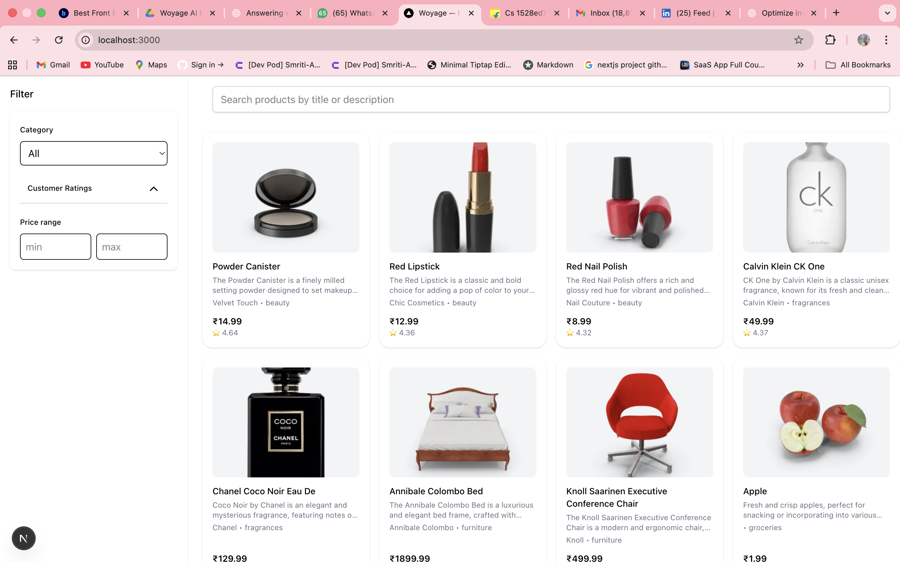
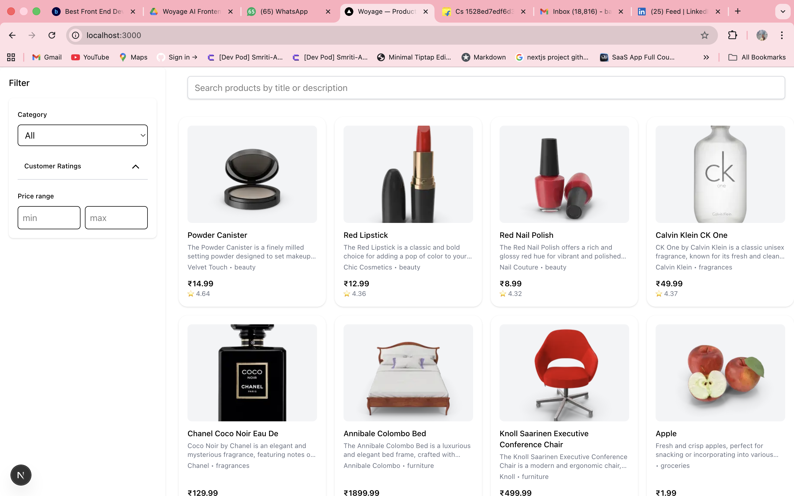

# E-Commerce Product Filter
A responsive e-commerce product listing page built with Next.js and Tailwind CSS, featuring search, filters by category, price, and rating, and optimized images.

## Screenshots

### Desktop View

### Mobile View

## Features
- Responsive product grid (1-4 columns depending on screen size)
- Filter products by category, price, and rating
- Search functionality
- Optimized images using Next.js Image component
- Lazy loading for faster performance

## Tech Stack
- Next.js
- React
- Tailwind CSS
- TypeScript
- Dummy JSON API 
